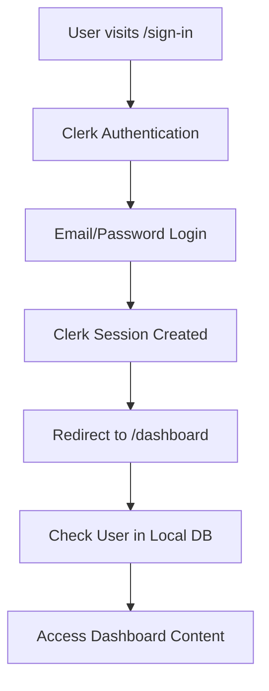
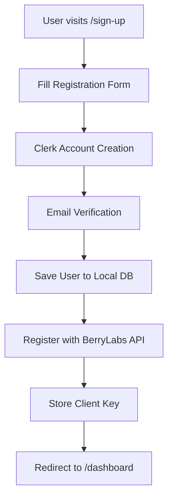
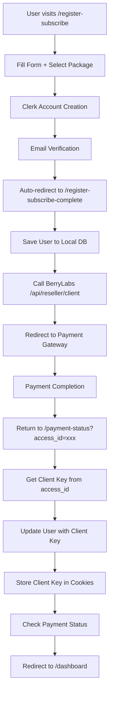

# WhatsApp AI Agent Management Platform

A comprehensive Next.js application for managing WhatsApp AI agents via the [BerryLabs API](https://docs.berrylabs.io/docs/api/wa-agent/overview). This platform provides a complete dashboard for creating, configuring, and managing intelligent WhatsApp chatbots with advanced features like knowledge bases, file references, webhook integrations, and scheduling.

🚀 **[Try Live Demo](https://reseller.berrylabs.io/)** - Experience the platform in action!

## 🚀 Features

### 📱 Agent Management

- **Create & Configure Agents**: Set up AI agents with custom names, descriptions, and system prompts
- **Multi-language Support**: English and Indonesian language options
- **Agent Dashboard**: View and manage all your agents in a comprehensive table
- **Delete Protection**: Confirmation dialogs prevent accidental deletions

### 🧠 Knowledge Base

- **Document Upload**: Support for PDF, DOCX, and other document formats
- **Text Content**: Add raw text content directly to the knowledge base
- **Smart Library**: Centralized document library with add/remove functionality
- **Auto-Assignment**: Uploaded documents automatically added to agent's knowledge base
- **Status Tracking**: Monitor document processing status (completed, processing, error)

### 📁 File References

- **File Upload**: Upload images, videos, audio, and documents for agent responses
- **Reference Codes**: Automatic generation of file reference codes (e.g., file-A, file-B)
- **Usage Instructions**: Built-in examples showing how to use file references in prompts
- **Smart Management**: Add files from library or upload new ones directly

### 🔧 Tools & Webhooks

- **Complete Configuration**: Full webhook setup with tabbed interface
- **HTTP Methods**: Support for GET, POST, PUT, PATCH, DELETE
- **Parameter Management**: Configure headers, path params, query params, and body params
- **Tool Testing**: Built-in testing functionality to validate webhook endpoints
- **Dynamic Variables**: Support for LLM prompts and dynamic variables in parameters

### 📞 WhatsApp Connection

- **QR Code Generation**: Easy WhatsApp account connection via QR scanning
- **Multiple Accounts**: Support for multiple WhatsApp accounts per user
- **Real-time Status**: WebSocket integration for live connection status updates
- **Account Management**: Connect, disconnect, and reconnect accounts with confirmation
- **Association Control**: Link specific WhatsApp accounts to individual agents

### ⏰ Scheduling

- **Operating Hours**: Configure daily operating schedules for each agent
- **Timezone Support**: Automatic timezone detection with manual override
- **Always Active Option**: 24/7 operation mode available
- **Day-specific Settings**: Individual schedules for each day of the week

### ⚙️ Advanced Settings

- **AI Behavior**: Configure manual takeover and auto-reset timings
- **Data Collection**: Custom fields for collecting specific information from users
- **Field Management**: Add, edit, and remove data collection fields with validation

## 🛠️ Technical Stack

- **Frontend**: Next.js 15.5.2 with App Router
- **Styling**: Tailwind CSS 4.1.13
- **UI Components**: Shadcn UI with Radix primitives
- **Icons**: Lucide React 0.542.0
- **HTTP Client**: Axios 1.11.0
- **Form Validation**: Zod schemas
- **Notifications**: Sonner toast library
- **Package Manager**: pnpm

## 🔧 Prerequisites

- Node.js 18.0 or higher
- pnpm (recommended) or npm
- BerryLabs account and API key
- Clerk account for authentication
- Prisma Postgres account (get from console.prisma.io)

## 📋 Setup Instructions

### Step 1: Clone and Install Dependencies

```bash
# Clone the repository
git clone <repository-url>
cd whatsapp-ai

# Install dependencies using pnpm (recommended)
pnpm install
# or using npm
npm install
```

### Step 2: Database Setup

This application uses **Prisma Postgres** for database management.

#### 2.1: Setup Prisma Postgres

1. **Sign up for Prisma Data Platform**

   - Go to [console.prisma.io](https://console.prisma.io)
   - Create a free account or log in

2. **Create a New Project**

   - Click "New Project" in the Prisma Console
   - Select "Prisma Postgres" as your database provider
   - Choose your preferred region

3. **Get Database Connection String**
   - After creating the project, Prisma will provide your connection string
   - Copy the `DATABASE_URL` - it will look like: `prisma://accelerate.prisma-data.net/?api_key=...`

### Step 3: Environment Configuration

Create a `.env.local` file in the project root directory and configure all required environment variables:

```bash
# =================================
# DATABASE CONFIGURATION
# =================================

# Prisma Postgres Database URL - Get this from console.prisma.io
# Format: prisma://accelerate.prisma-data.net/?api_key=your_api_key
PRISMA_DATABASE_URL="prisma://accelerate.prisma-data.net/?api_key=your_prisma_api_key"

# =================================
# CLERK AUTHENTICATION
# =================================

# Get these from https://dashboard.clerk.com
# Navigate to: Dashboard → Your App → API Keys

# Clerk Publishable Key (starts with pk_test_ or pk_live_)
NEXT_PUBLIC_CLERK_PUBLISHABLE_KEY="pk_test_your-publishable-key-here"

# Clerk Secret Key (starts with sk_test_ or sk_live_)
CLERK_SECRET_KEY="sk_test_your-secret-key-here"

# Clerk URL Configuration
NEXT_PUBLIC_CLERK_SIGN_IN_URL="/sign-in"
NEXT_PUBLIC_CLERK_SIGN_UP_URL="/sign-up"
NEXT_PUBLIC_CLERK_AFTER_SIGN_IN_URL="/dashboard"
NEXT_PUBLIC_CLERK_AFTER_SIGN_UP_URL="/dashboard"

# =================================
# BERRYLABS API CONFIGURATION
# =================================

# BerryLabs API Base URL
NEXT_PUBLIC_BERRYLABS_API_URL="https://api.berrylabs.io"

# BerryLabs API Key - Get from https://app.berrylabs.io
# Navigate to: User Avatar → API Keys → Generate API Key
NEXT_PUBLIC_BERRYLABS_API_KEY="your-berrylabs-api-key-here"

# =================================
# OPTIONAL: DEVELOPMENT SETTINGS
# =================================

# Next.js Development Mode
NODE_ENV="development"

# Enable Prisma Debug Logging (optional)
# DEBUG="prisma:query"
```

| Variable                            | Required | Description                           | Example                                            |
| ----------------------------------- | -------- | ------------------------------------- | -------------------------------------------------- |
| `PRISMA_DATABASE_URL`               | ✅       | **Prisma Postgres connection string** | `prisma://accelerate.prisma-data.net/?api_key=...` |
| `NEXT_PUBLIC_CLERK_PUBLISHABLE_KEY` | ✅       | Clerk frontend authentication key     | `pk_test_...`                                      |
| `CLERK_SECRET_KEY`                  | ✅       | Clerk backend secret key              | `sk_test_...`                                      |
| `NEXT_PUBLIC_BERRYLABS_API_URL`     | ✅       | BerryLabs API base URL                | `https://api.berrylabs.io`                         |
| `NEXT_PUBLIC_BERRYLABS_API_KEY`     | ✅       | Your BerryLabs API key                | `your-api-key`                                     |
| `NODE_ENV`                          | ❌       | Development environment               | `development`                                      |

### 🚨 Security Notes

- **Never commit `.env.local`** to version control
- **Use different API keys** for development and production
- **Restrict database access** to necessary IP addresses only
- **Use strong passwords** for database connections
- **Rotate API keys regularly** for better security

#### 3.1: Get Your BerryLabs API Key

BerryLabs supports two types of authentication based on your account type:

- **Standard Users**: Use `xi-api-key` only (for personal use)
- **Reseller Partners**: Use both `xi-api-key` and `xi-client-key` (for managing client accounts)

Choose the appropriate guide below based on your use case:

---

##### 📌 For Standard Users (Personal Use)

If you're using BerryLabs for your own WhatsApp AI agents, follow these steps:

**Step 1: Register an Account**

1. Go to [app.berrylabs.io/auth/register](https://app.berrylabs.io/auth/register)
2. Complete the registration process with your details
3. Verify your email address if required

**Step 2: Access API Keys**

1. Log in to the BerryLabs platform at [app.berrylabs.io](https://app.berrylabs.io/auth/login)
2. Click on your **user avatar** at the **bottom left** of the interface
3. A modal will appear - select **"API Keys"** from the options

**Step 3: Generate API Key**

1. In the API Keys section, click **"Generate API Key"**
2. Give your API key a descriptive name (e.g., "Production API", "WhatsApp AI Development")
3. **Important**: Copy the generated API key **immediately**
4. Add it to your `.env.local` file as `NEXT_PUBLIC_BERRYLABS_API_KEY`
5. Store it securely as it won't be shown again

**⚠️ Important Notes:**

- Save your API key immediately after generation
- The key will only be displayed once for security reasons
- If you lose your key, you'll need to generate a new one

**Example `.env.local` configuration:**

```bash
NEXT_PUBLIC_BERRYLABS_API_KEY="your-standard-api-key-here"
```

📚 **Learn More**: [Standard User Authentication Guide](https://docs.berrylabs.io/docs/api/wa-agent/authentication/#standard-user-authentication)

---

##### 🤝 For Reseller Partners (Managing Client Accounts)

If you're a reseller managing multiple client accounts or building a platform to resell BerryLabs services, follow these steps:

**Overview**

Reseller authentication enables you to manage multiple end clients through a single reseller account. There are two main use cases:

1. **Client Registration & Subscription Management** - Only requires `xi-api-key`
2. **Managing Existing Client Resources** - Requires both `xi-api-key` and `xi-client-key`

**Step 1: Apply for Reseller Status**

1. Visit the [BerryLabs Partner Program Application](https://berrylabs.io/mitra/daftar)
2. Fill out the partnership application form (choose Business or Individual partnership)
3. Submit your application and complete the verification process
4. Wait for approval confirmation from the BerryLabs team
5. You'll receive notification when your reseller status is approved

**Step 2: Access Reseller Dashboard**

1. Log in to [app.berrylabs.io](https://app.berrylabs.io)
2. Click on the **navbar** to find the **"Reseller Dashboard"** switcher
3. Switch to your approved **Reseller Dashboard**
4. You'll be redirected to the reseller-specific interface

**Step 3: Get Your Reseller API Key**

1. In the Reseller Dashboard, click on the **"Settings"** menu
2. Select **"API Keys"** from the submenu options
3. Your reseller API key will be displayed (or generate one if needed)
4. Copy the reseller API key
5. Add it to your `.env.local` file as `NEXT_PUBLIC_BERRYLABS_API_KEY`

**Step 4: Understanding Client Keys**

Reseller API authentication varies by endpoint type:

**For Registration/Subscription Endpoints** (No client key needed):

- `POST /api/reseller/client/register`
- `POST /api/reseller/client`
- `POST /api/reseller/client/subscription`
- `POST /api/reseller/client/client-key`
- `GET /api/reseller/client/packages`
- `GET /api/reseller/client/order/{orderId}/status`

**For Resource Management Endpoints** (Client key required):

- All agent management endpoints (`/v1/wa/agents/*`)
- All WhatsApp account endpoints (`/v1/wa/accounts/*`)
- All knowledge base endpoints (`/v1/wa/knowledge/*`)

**Example `.env.local` configuration:**

```bash
# Your Reseller API Key (for all operations)
NEXT_PUBLIC_BERRYLABS_API_KEY="your-reseller-api-key-here"

# Client keys are obtained dynamically per client and stored in cookies/database
# This app automatically manages client keys through the authentication flow
```

**How This App Handles Reseller Authentication:**

This application automatically handles both reseller authentication scenarios:

1. **During Registration/Subscription**: Uses only the reseller API key
2. **During Resource Management**: Automatically includes the client key from cookies when available
3. **Client Key Storage**: Client keys are stored in cookies after successful payment and retrieved automatically

**Getting Client Keys After Registration:**

After a client completes payment through your reseller account:

1. Use the `access_id` from the payment callback
2. Call `POST /api/reseller/client/client-key` with the `access_id`
3. Store the returned `client_key` securely in your system
4. This app stores it in cookies automatically using `setClientKeyCookie()`

**🔑 Important Reseller Notes:**

- Reseller API keys have different permissions than standard user keys
- Client keys are required for managing specific client resources
- Follow a separate application-based approval process (not self-service)
- Each client you register will have their own unique `xi-client-key`

📚 **Learn More**: [Reseller Authentication Guide](https://docs.berrylabs.io/docs/api/wa-agent/authentication/#reseller-authentication)

---

##### 🔐 Authentication Flow in This Application

This application is designed to work seamlessly for both user types:

**For Standard Users:**

- API key is set in `.env.local` and used for all requests
- No client key management needed
- Direct access to personal agents and resources

**For Reseller Partners:**

- Reseller API key is set in `.env.local`
- Client keys are managed automatically through the authentication flow
- The app detects missing client keys and shows helpful banners with partnership information
- The subscription page shows reseller partnership opportunities for unauthorized users

**Automatic Client Key Management:**

The application includes built-in client key management:

- `getClientKeyFromCookie()` - Retrieves stored client key
- `setClientKeyCookie()` - Stores client key after successful payment
- `removeClientKeyCookie()` - Clears client key on logout
- Axios interceptors automatically include client keys in API requests

#### 3.2: Setup Clerk Authentication

1. **Create Clerk Account**

   - Go to [dashboard.clerk.com](https://dashboard.clerk.com)
   - Sign up for a free account
   - Create a new application

2. **Get API Keys**

   - In your Clerk dashboard, go to **API Keys**
   - Copy the **Publishable Key** and **Secret Key**
   - Add both keys to your `.env.local` file

3. **Configure Authentication URLs**
   - The authentication URLs are already configured in the example above
   - These routes (`/sign-in`, `/sign-up`, `/dashboard`) must match your application structure

### Step 4: Database Migration and Setup

Once your environment variables are configured, set up the database schema:

#### 4.1: For Development Environment

```bash
# Generate Prisma client
pnpm prisma generate
# or
npx prisma generate

# Run database migrations to create tables (development only)
pnpm prisma migrate dev --name init
# or
npx prisma migrate dev --name init

# (Optional) Seed database with initial data
pnpm prisma db seed
# or
npx prisma db seed

# (Optional) Open Prisma Studio to view/edit data
pnpm prisma studio
# or
npx prisma studio
```

#### 4.2: For Production Deployment

```bash
# Generate Prisma client
pnpm prisma generate

# Deploy migrations to production (use this in production, NOT migrate dev)
pnpm prisma migrate deploy
# or
npx prisma migrate deploy
```

**Important**:

- Use `prisma migrate dev` only in development
- Use `prisma migrate deploy` for production deployments
- Never run `prisma migrate dev` in production as it may cause data loss

#### 4.3: Understanding the Database Schema

The application creates these main tables:

- **users**: Local user data with Clerk integration
- **agents**: WhatsApp AI agent configurations
- **subscriptions**: User subscription records
- **orders**: Payment and order tracking

#### 4.4: Additional Migration Commands

```bash
# View migration status
pnpm prisma migrate status

# Reset database (WARNING: deletes all data - development only)
pnpm prisma migrate reset

# Create a new migration after schema changes (development only)
pnpm prisma migrate dev --name your-migration-name
```

### Step 5: Verify Setup

Test your configuration:

```bash
# Check database connection
pnpm prisma db pull

# Validate environment variables
pnpm dev

# Check if all services are running
echo "Visit http://localhost:3000 to see your application"
```

### Step 6: Start Development Server

```bash
# Start the development server
pnpm dev
# or
npm run dev
```

Open [http://localhost:3000](http://localhost:3000) in your browser.

## 🔐 Authentication & User Flow

1. **API Headers**: Automatically added to all BerryLabs API calls

### 🔑 Authentication Stack

- **Frontend Auth**: [Clerk](https://clerk.com) - Complete user authentication solution
- **Database**: [Prisma](https://prisma.io) - Type-safe database ORM
- **External API**: [BerryLabs API](https://docs.berrylabs.io) - WhatsApp AI agent management
- **Session Management**: Cookie-based client key storage for API access

### 📊 Database Schema

The application uses a dual-database architecture:

```prisma
model User {
  id              String   @id @default(cuid())
  clerkId         String   @unique
  email           String
  firstName       String
  lastName        String
  phone           String?
  clientKey       String?  // BerryLabs API client key
  berryLabsUserId String?  // BerryLabs user ID
  createdAt       DateTime @default(now())
  updatedAt       DateTime @updatedAt
  subscriptions   Subscription[]
}

model Subscription {
  id               String   @id @default(cuid())
  userId           String
  packageId        String
  subscriptionId   String   @unique
  packageName      String
  status           String
  totalAmount      String
  subsType         String?
  organizationId   String?
  createdAt        DateTime @default(now())
  updatedAt        DateTime @updatedAt
  user             User     @relation(fields: [userId], references: [id])
  orders           Order[]
}

model Order {
  id             String        @id @default(cuid())
  userId         String
  subscriptionId String?
  orderId        String        @unique
  amount         String
  status         String
  createdAt      DateTime      @default(now())
  updatedAt      DateTime      @updatedAt
  user           User          @relation(fields: [userId], references: [id])
  subscription   Subscription? @relation(fields: [subscriptionId], references: [id])
}
```

### 🚪 Authentication Flows

#### 1. **Regular Login Flow**



**Implementation:**

- Uses Clerk's built-in sign-in component
- Automatic session management
- Protected routes via Clerk middleware

#### 2. **Regular Registration Flow**



**Implementation:**

```typescript
// src/components/custom-signup.tsx
const handleVerification = async () => {
  // 1. Complete Clerk verification
  const completeSignUp = await signUp.attemptEmailAddressVerification({
    code: verificationCode,
  });

  // 2. Save to local database
  await createUserInDatabase({
    clerkId: completeSignUp.createdUserId!,
    email: formData.email,
    firstName: formData.firstName,
    lastName: formData.lastName,
    phone: formData.phone,
  });

  // 3. Register with BerryLabs API
  const apiResponse = await clientApi.register({
    name: `${formData.firstName} ${formData.lastName}`,
    email: formData.email,
    phone: formData.phone,
  });

  // 4. Store client key
  setClientKeyCookie(apiResponse.data.client_key);
  await updateUserWithBerryLabsData(userId, apiResponse.data);
};
```

#### 3. **Register + Subscribe Flow**



**Key Implementation Details:**

**Step 1: Registration with Package Selection**

```typescript
// src/app/register-subscribe/page.tsx
const handleSubmit = async (e: React.FormEvent) => {
  // Standard Clerk registration
  await signUp.create({
    emailAddress: formData.email,
    password: formData.password,
    unsafeMetadata: {
      firstName: formData.firstName,
      lastName: formData.lastName,
      phone: formData.phone,
    },
  });

  // Store package data for later
  localStorage.setItem(
    "postRegistrationSubscription",
    JSON.stringify({
      packageId: packageId,
      billingCycle: billingCycle,
      userEmail: formData.email,
      userPhone: formData.phone,
      userName: `${formData.firstName} ${formData.lastName}`,
    })
  );

  // Redirect to email verification
  router.push("/verify-email?redirect=/register-subscribe-complete");
};
```

**Step 2: Automatic Subscription Creation**

```typescript
// src/app/register-subscribe-complete/page.tsx
const handleCreateAccount = async () => {
  // 1. Create user in local database
  await createUserInDatabase({
    clerkId: user.id,
    email: user.primaryEmailAddress?.emailAddress,
    firstName: user.unsafeMetadata?.firstName,
    lastName: user.unsafeMetadata?.lastName,
    phone: user.unsafeMetadata?.phone,
  });

  // 2. Call BerryLabs API to register + create subscription
  const response = await clientApi.createSubscriptionRegister({
    name: subscriptionData.userName,
    phone: subscriptionData.userPhone,
    email: subscriptionData.userEmail,
    package_id: subscriptionData.packageId,
    sub_type: subscriptionData.billingCycle,
  });

  // 3. Redirect to payment
  window.location.href = response.data.url;
};
```

**Step 3: Payment Status with Client Key Setup**

```typescript
// src/app/payment-status/page.tsx
useEffect(() => {
  const setupClientKeyFromAccessId = async () => {
    if (!accessId || !user) return;

    // Get client key from access_id
    const response = await clientApi.getClientKey(accessId);

    if (response?.data?.client_key) {
      // Set client key in cookies
      setClientKeyCookie(response.data.client_key);

      // Update user's clientKey in database
      await updateUserClientKey(
        user.id,
        response.data.client_key,
        response.data.user_id
      );

      // Mark setup as complete
      setClientKeySetupComplete(true);
    }
  };

  setupClientKeyFromAccessId();
}, [accessId, user]);

// Only check payment status after client key setup
useEffect(() => {
  if (orderId && (!accessId || clientKeySetupComplete)) {
    checkPaymentStatus();
  }
}, [orderId, accessId, clientKeySetupComplete]);
```

### 🔑 Client Key Management

The **client key** is crucial for accessing BerryLabs API endpoints and must be properly managed:

#### Storage Locations:

1. **Database**: `users.clientKey` field for persistence
2. **Cookies**: `xi-client-key` for API requests
3. **API Headers**: Automatically added to all BerryLabs API calls

#### API Integration:

```typescript
// src/lib/api.ts
api.interceptors.request.use((config) => {
  const clientKey = getClientKeyFromCookie();
  const apiKey = process.env.NEXT_PUBLIC_BERRYLABS_API_KEY;

  if (apiKey) {
    config.headers["xi-api-key"] = apiKey;
  }

  if (clientKey) {
    config.headers["xi-client-key"] = clientKey;
  }

  return config;
});
```

### 🛡️ Protected Routes

Dashboard access requires both Clerk authentication and a valid client key:

```typescript
// Dashboard protection logic
const { user } = useUser();
const [hasClientKey, setHasClientKey] = useState(false);

useEffect(() => {
  const checkClientKey = async () => {
    if (user) {
      const clientKey = getClientKeyFromCookie();
      if (!clientKey) {
        // Redirect to registration or setup
        router.push("/setup-account");
      } else {
        setHasClientKey(true);
      }
    }
  };

  checkClientKey();
}, [user]);
```

### 🔧 API Endpoints

#### User Management:

- `POST /api/users/create` - Create user in local database
- `POST /api/users/update-client-key` - Update user's client key
- `POST /api/users/update-berrylabs-data` - Update BerryLabs user data

#### Subscription Management:

- `POST /api/subscriptions/create` - Create subscription record
- `POST /api/orders/save` - Save order information

#### External BerryLabs API:

- `POST /api/reseller/client/register` - Register user only
- `POST /api/reseller/client` - Register user + create subscription
- `POST /api/reseller/client/client-key` - Get client key from access_id
- `GET /api/reseller/client/order/{orderId}/status` - Check payment status

### 🔍 Troubleshooting Setup

**Database Connection Issues:**

```bash
# Test database connection
pnpm prisma db pull
```

**Clerk Authentication Issues:**

- Verify API keys are correct
- Check that domain matches in Clerk dashboard
- Ensure authentication URLs are properly configured

**BerryLabs API Issues:**

- Verify API key is active
- Check API key permissions
- Test API connection with a simple curl request:

```bash
curl -X GET https://api.berrylabs.io/v1/wa/agents \
  -H "xi-api-key: your-api-key" \
  -H "Content-Type: application/json"
```

**Build or Runtime Errors:**

```bash
# Clear Next.js cache
rm -rf .next

# Reinstall dependencies
rm -rf node_modules package-lock.json
pnpm install

# Regenerate Prisma client
pnpm prisma generate
```

## 📄 License & Usage Terms

### 🆓 Free & Open Source

This project is **free and open source** for personal and internal business use. You can:

- Use it for your own WhatsApp AI agents
- Modify the code to suit your needs
- Deploy it for your organization's internal use

### 🤝 Partnership & Reseller Program

If you plan to **resell this solution** or **manage multiple clients**, you'll need:

**📋 Complete Partnership Information**: [BerryLabs Partnership Program](https://berrylabs.io/mitra)

#### Reseller Requirements

- **Reseller API Key**: Required for managing multiple client accounts
- **Client Key**: Needed for end-client management via BerryLabs Partnership Program
- **Authentication**: Follow the [Reseller Authentication Guide](https://docs.berrylabs.io/docs/api/wa-agent/authentication#reseller-authentication)

#### Partnership Benefits

- **Attractive Revenue Sharing**: Up to 60% revenue share for qualified resellers
- Access to reseller API endpoints
- Client management capabilities
- Partner support and resources
- Comprehensive partner training and onboarding

### 🏷️ Branding Requirements

- **Keep BerryLabs Branding**: The "Powered by BerryLabs" branding must remain visible
- **Attribution Required**: Do not remove existing BerryLabs brand elements
- **Whitelabel Options**: Available for qualified partners

#### Whitelabel Program

For custom branding and whitelabel solutions:

- **Contact**: team@berrylabs.io
- **Subject**: Partnership Whitelabel Program
- **Include**: Your use case and partnership requirements

### ⚖️ Usage Summary

- ✅ **Free Use**: Personal and internal business use
- ✅ **Modifications**: Code customization allowed
- ❌ **Reselling**: Requires partnership agreement and reseller keys
- ❌ **Brand Removal**: BerryLabs attribution must remain
- 💼 **Commercial**: Whitelabel options available through partnership

## 🎯 Usage Guide

### Creating Your First Agent

1. **Access Dashboard**: Navigate to the main page to see your agents table
2. **Create Agent**: Click "Create Agent" button in the top right
3. **Configure Basic Info**:
   - Set agent name and description
   - Choose language (English/Indonesian)
   - Write comprehensive system prompt

### Setting Up Knowledge Base

1. **Navigate to Agent Details**: Click on any agent from the table
2. **Go to Agent Tab**: The first tab contains knowledge base configuration
3. **Add Documents**:
   - **Upload File**: Click "Upload File" for PDF, DOCX, etc.
   - **Add Text**: Click "Add Text" for raw text content
   - **From Library**: Use "Add from Library" for previously uploaded documents

### Configuring File References

1. **Upload Files**: Use "Upload File" in the File References section
2. **Reference in Prompts**: Use the generated file codes in your system prompt
   ```
   Example: "When client asks about menu, send file-A"
   ```
3. **View Instructions**: Built-in examples show proper usage patterns

### Setting Up Tools & Webhooks

1. **Add Tool**: Click "Add Tool" in the Tools section
2. **Configure Endpoint**:
   - Set tool name and description
   - Enter webhook URL and HTTP method
3. **Configure Parameters**:
   - **Headers**: Add authentication headers
   - **Path Params**: Define URL path parameters
   - **Query Params**: Set URL query parameters
   - **Body**: Configure request body for POST/PUT/PATCH
4. **Test Tool**: Use built-in testing to validate configuration

### WhatsApp Connection

1. **Go to WhatsApp Tab**: Click the WhatsApp tab in agent details
2. **Generate QR Code**: Click "Connect New Account"
3. **Scan QR**: Use WhatsApp mobile app to scan the displayed QR code
4. **Associate Account**: Toggle the switch to associate account with agent

### Scheduling Configuration

1. **Navigate to Scheduling Tab**: Configure operating hours
2. **Set Mode**:
   - **Always Active**: 24/7 operation
   - **Scheduled**: Custom hours per day
3. **Configure Daily Hours**: Set open/close times for each day
4. **Select Timezone**: Choose appropriate timezone

## 📚 API Documentation

- **Complete API Docs**: [BerryLabs API Documentation](https://docs.berrylabs.io/docs/api/wa-agent/overview)
- **Authentication Guide**: [API Key Authentication](https://docs.berrylabs.io/docs/api/wa-agent/authentication)

## 🔐 Authentication

All API requests require authentication via header:

```bash
xi-api-key: your-api-key
Content-Type: application/json
```

Example request:

```bash
curl -X GET https://api.berrylabs.io/v1/wa/agents \
  -H "xi-api-key: your-api-key" \
  -H "Content-Type: application/json"
```

## 🎨 UI/UX Features

- **Toast Notifications**: Success/error feedback for all operations
- **Auto-scroll**: Automatic scrolling to relevant sections when needed
- **Floating Save CTA**: Context-aware save button appears when changes are made
- **Loading States**: Visual feedback during API operations
- **Responsive Design**: Works on desktop and mobile devices
- **Confirmation Dialogs**: Prevent accidental data loss

## 🏗️ Project Structure

```
src/
├── app/                    # Next.js app router pages
│   ├── agent/[id]/        # Agent detail page
│   └── page.tsx           # Main dashboard
├── components/            # Reusable UI components
│   ├── agent-tabs/        # Agent configuration tabs
│   ├── ui/               # Shadcn UI components
│   └── modals/           # Upload and configuration modals
├── lib/                  # Utilities and API configuration
│   ├── api.ts           # BerryLabs API client
│   └── utils.ts         # Helper functions
├── schemas/              # Zod validation schemas
│   └── agent-schema.ts  # Agent data validation
└── types/               # TypeScript type definitions
    ├── agent.ts         # Agent-related types
    ├── files.ts         # File management types
    └── knowledge-base.ts # Knowledge base types
```

## 🤝 Contributing

1. Fork the repository
2. Create a feature branch
3. Make your changes
4. Test thoroughly
5. Submit a pull request

## 🆘 Support

- **API Issues**: Check [BerryLabs Documentation](https://docs.berrylabs.io)
- **Technical Support**: Contact BerryLabs support team
- **Project Issues**: Create an issue in this repository

---

**Powered by BerryLabs** 🍒 - [Visit BerryLabs](https://berrylabs.io)
